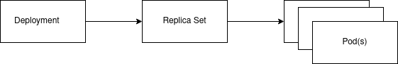

# déploiement simple

Il est rare que l'on utilise directement la resource pod ou replica set. Nous utilisons couramment le déploiement et le service

---

## exemple pod

déploiement du pod uniquement: pod.yml
on utilise rarement un pod nous même

---

## exemple replica set

déploiement du replica set, et donc de plusieurs pods identique : replicaset.yml
on utilise rarement un replica set nous même

---

## exemple d'un deploiement

déploiement d'un deployment : deployment.yml

---

## exemple d'un service (construit sur le déploiement précédent)

déploiement d'un service : service.yml

---

## exemple de rolling-update

`kubectl set image deployment hello hello=worming/http-helloworld:v2`
