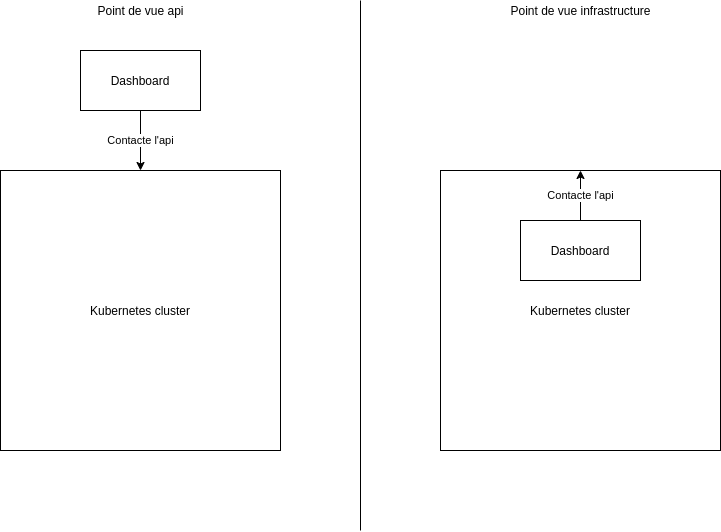

# Introduction à Kubernetes

* Lesson personnel
* [Kubernetes in action](https://www.manning.com/books/kubernetes-in-action-second-edition?query=Kubernetes%20in%20Action,%20Second%20Edition&gclid=Cj0KCQiAzMGNBhCyARIsANpUkzPtWs-27sVlOzG5miNNU4Y8GGFcKlQIGxYNu_x_KD8Erp8AxNIdFMkaAgxiEALw_wcB)

---

## Dev et Ops

| Dev teams                                                                   | Ops team                                           |
| --------------------------------------------------------------------------- | -------------------------------------------------- |
| * écris le code                                                             | * déploie le code                                  |
| * l'application écrit des logs                                              | * lis les logs en cas de problème                  |
| * pas/peu de retour des plaintes -> se préocupe moins de la qualité en prod | * connait le produit via les démos et l'expérience |
| * parfois documente comment déployer                                        | * déploie et croise les doigts                     |

---

## Plan

* Déploiment et description d'un pod
  * Replica Set
  * Deploiement
  * Service
* Use case commun
  * Déploiement d'un service
  * Rolling update

---

## Quand l'opération est entre les mains du développeur, il automatise

Jenkins, Octopus, Github actions, Azure Devops, etc ...

---

### Mais ne veut pas maintenir le serveur

Serverless, containarization (docker, etc)

si vous n'avez pas encore de cluster:

* `az group create -l westeurope -n kintro`
* `az aks create -n kintro -g kintro -c 2`
* `az aks get-credentials -g kintro -n kintro`
  
Une ligne de commande pour déployer nginx :
`kubectl run nginx --image nginx`

---

## Un dashboard simple pour cette démo

`kubectl apply -f https://raw.githubusercontent.com/kubernetes/dashboard/master/aio/deploy/recommended.yaml`
`kubectl proxy`
naviguer sur http://localhost:8001/api/v1/namespaces/kubernetes-dashboard/services/https:kubernetes-dashboard:/proxy/ (et lire ./dashboard/readme.md)

---

### Wait ... où est le serveur web du dashboard ?

---

## Kubernetes est un orchestrateur de déploiement (et un peu plus)

* abstraction totale ou partielle de l'infrastructure
* assure une santé des services via un monitoring de santé et de performances

---

### Mais du coup .. c'est quoi un Pod ?

* Une unité de déploiement
* Contient un ou plusieurs container (reverse proxy, side-car, service-mesh, etc ...)

---

## suite dans le dossier deploiement-pod
